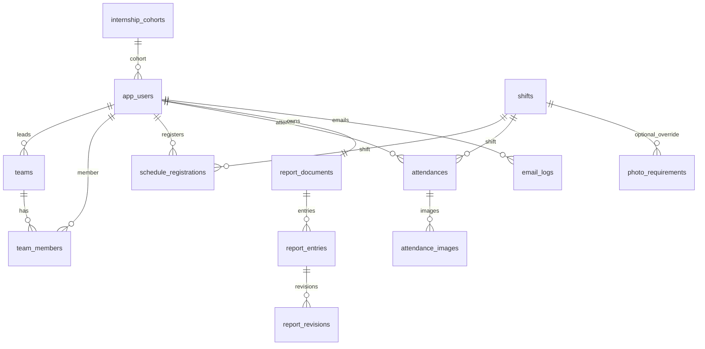

# InternFlow Database Schema

Nguồn chuẩn hiện tại:

```text
db/init_production.sql
src/main/java/com/java6/springboot/internflow/entity/*.java
src/main/java/com/java6/springboot/internflow/enums/*.java
```

`db/init_production.sql` là baseline cho DB PostgreSQL mới. Không chạy file này trên DB đã có dữ liệu. DB đang chạy cần nâng cấp bằng rollup migration `db/migrations/2026-05-31-r2-foundation-shift-photo-source.sql`.

## Quy ước

| Nhóm | Quy ước |
| --- | --- |
| DB engine | PostgreSQL |
| UUID | `uuid default gen_random_uuid()` từ `pgcrypto` |
| Time fields | `timestamp`/`date`/`time` theo entity hiện tại |
| Enum | Lưu dạng `varchar`, có `check constraint` trong baseline |
| Existing DB | Chạy migration, không chạy baseline |
| Fresh DB | Chạy baseline, sau đó app seed/config nếu cần |

## Sơ đồ quan hệ chính



## Tables

### internship_cohorts

| Column | Type | Null | Key/default | Meaning |
| --- | --- | --- | --- | --- |
| `id` | `uuid` | no | PK, `gen_random_uuid()` | Khóa thực tập |
| `code` | `varchar(60)` | no | unique | Mã khóa |
| `name` | `varchar(120)` | no | | Tên khóa |
| `start_date` | `date` | no | | Ngày bắt đầu |
| `end_date` | `date` | yes | | Ngày kết thúc |
| `active` | `boolean` | no | `true` | Đang mở |
| `default_for_new_students` | `boolean` | no | `true` | Gán mặc định cho SV mới |
| `created_at` | `timestamp` | no | `now()` | Tạo lúc |
| `updated_at` | `timestamp` | no | `now()` | Cập nhật lúc |

### app_users

| Column | Type | Null | Key/default | Meaning |
| --- | --- | --- | --- | --- |
| `id` | `uuid` | no | PK | User |
| `email` | `varchar(150)` | no | unique | Google email |
| `full_name` | `varchar(120)` | no | | Họ tên |
| `student_code` | `varchar(50)` | yes | unique | MSSV |
| `student_class` | `varchar(80)` | yes | | Lớp |
| `school` | `varchar(120)` | yes | | Trường |
| `phone` | `varchar(30)` | yes | | SĐT |
| `cohort_id` | `uuid` | yes | FK `internship_cohorts.id` | Khóa thực tập |
| `role` | `varchar(30)` | no | `INTERN` | `INTERN`, `TEAM_LEADER`, `MANAGER`, `ADMIN` |
| `active` | `boolean` | no | `true` | Đang hoạt động |
| `created_at` | `timestamp` | no | `now()` | Tạo lúc |
| `updated_at` | `timestamp` | no | `now()` | Cập nhật lúc |

### shifts

| Column | Type | Null | Key/default | Meaning |
| --- | --- | --- | --- | --- |
| `id` | `uuid` | no | PK | Ca |
| `code` | `varchar(30)` | no | unique | `SHIFT_1`, ... |
| `name` | `varchar(80)` | no | | Tên ca |
| `start_time` | `time` | no | | Bắt đầu |
| `end_time` | `time` | no | | Kết thúc |
| `category` | `varchar(30)` | no | `COMPANY` | `COMPANY`, `HOME_REPORT` |
| `max_participants` | `integer` | no | `9` | Slot tối đa |
| `shift_order` | `integer` | no | `0` | Thứ tự dùng cho hiển thị/rule liền kề |
| `display_group` | `varchar(80)` | yes | | Nhóm hiển thị, ví dụ `Ban ngay`, `Buoi toi` |
| `is_night_shift` | `boolean` | no | `false` | Đánh dấu ca tối độc lập với mã ca |
| `active` | `boolean` | no | `true` | Đang mở |

### role_policies

| Column | Type | Null | Key/default | Meaning |
| --- | --- | --- | --- | --- |
| `id` | `uuid` | no | PK | Chính sách |
| `role` | `varchar(30)` | no | unique | Role áp dụng |
| `max_shifts_per_day` | `integer` | no | | Ca tối đa/ngày |
| `target_shifts_per_week` | `integer` | no | | Mục tiêu ca/tuần |
| `required_company_shifts` | `integer` | no | | Ca công ty cần đủ |
| `required_home_shifts` | `integer` | no | | Ca báo cáo tại nhà cần đủ |
| `night_shift_bonus_threshold` | `integer` | no | `0` | Ngưỡng bonus ca tối |
| `night_shift_bonus_amount` | `integer` | no | `0` | Số ca bonus ca tối |
| `leadership_bonus_threshold` | `integer` | no | `0` | Ngưỡng bonus nhóm trưởng |
| `leadership_bonus_amount` | `integer` | no | `0` | Số ca bonus nhóm trưởng |

### teams / team_members

| Table | Key columns | Meaning |
| --- | --- | --- |
| `teams` | `id`, `name unique`, `leader_id -> app_users.id`, `active`, timestamps | Nhóm do team leader quản lý |
| `team_members` | `id`, `team_id -> teams.id`, `user_id unique -> app_users.id`, `joined_at` | Mỗi user chỉ thuộc một nhóm |

### schedule_registrations

| Column | Type | Null | Key/default | Meaning |
| --- | --- | --- | --- | --- |
| `id` | `uuid` | no | PK | Đăng ký ca |
| `user_id` | `uuid` | no | FK `app_users.id` | Người đăng ký |
| `shift_id` | `uuid` | no | FK `shifts.id` | Ca |
| `schedule_date` | `date` | no | | Ngày làm |
| `status` | `varchar(30)` | no | `REGISTERED` | `REGISTERED`, `CANCELLED` |
| `note` | `varchar(500)` | yes | | Ghi chú |
| `created_at` | `timestamp` | no | `now()` | Tạo lúc |
| `updated_at` | `timestamp` | no | `now()` | Cập nhật lúc |

Unique: `uk_schedule_user_shift_date(user_id, shift_id, schedule_date)`.

### attendances / attendance_images

| Table | Key columns | Meaning |
| --- | --- | --- |
| `attendances` | `user_id`, `shift_id`, `attendance_date`, status/checkin/checkout/location/report fields | Điểm danh thực tế theo user/ca/ngày |
| `attendance_images` | `attendance_id`, `image_type`, `phase`, `expected_time`, image metadata, retention/delete fields | Slot ảnh và metadata Cloudinary |

Unique:

```sql
uk_attendance_user_shift_date(user_id, shift_id, attendance_date)
uk_attendance_image_slot(attendance_id, image_type, phase, expected_time)
```

### report_documents / report_entries / report_revisions

| Table | Key columns | Meaning |
| --- | --- | --- |
| `report_documents` | `user_id unique`, `title`, `total_pages`, `completed_shift_count`, `current_file_name` | Nhật ký tổng của một user |
| `report_entries` | `document_id`, `work_date`, `shift_codes`, content/reference/source/page/status | Entry nhật ký theo ngày |
| `report_revisions` | `entry_id`, old/new content, diff, page counts | Lịch sử sửa entry |

Unique: `uk_report_entry_document_date(document_id, work_date)`.

### email_logs

| Column group | Meaning |
| --- | --- |
| `user_id`, `subject`, `receivers`, `cc_receivers`, `work_date` | Nội dung/ngày mail |
| `sent_at`, `status`, `error_message`, `attachment_count` | Kết quả gửi/confirm |

Status: `PENDING`, `SENT`, `MANUAL_CONFIRMED`, `FAILED`.

### photo_requirements

| Column | Type | Null | Key/default | Meaning |
| --- | --- | --- | --- | --- |
| `id` | `bigint identity` | no | PK | Rule ảnh |
| `role` | `varchar(30)` | no | | Role áp dụng |
| `shift_id` | `uuid` | yes | FK `shifts.id` | Null = default mọi ca; non-null = override ca |
| `image_type` | `varchar(30)` | no | | `PERSONAL_TIMEMARK`, `GROUP` |
| `phase` | `varchar(30)` | no | | `CHECKIN`, `DURING_SHIFT`, `CHECKOUT` |
| `required_count` | `integer` | no | `1` | Số ảnh yêu cầu |
| `interval_minutes` | `integer` | yes | | Chu kỳ ảnh giữa ca |
| `active` | `boolean` | no | `true` | Bật/tắt rule |
| `note` | `varchar(500)` | yes | | Ghi chú |
| `created_at` | `timestamp` | no | `now()` | Tạo lúc |
| `updated_at` | `timestamp` | no | `now()` | Cập nhật lúc |

Unique scope: `role + shift/default + image_type + phase + interval/default`.

## Seed chuẩn

Baseline seed system data:

| Table | Rows |
| --- | --- |
| `shifts` | `SHIFT_1..SHIFT_4` |
| `role_policies` | `INTERN`, `TEAM_LEADER`, `MANAGER`, `ADMIN` |
| `photo_requirements` | 12 default rules cho `INTERN` và `TEAM_LEADER` |

Demo users/admin emails vẫn do `DataInitializer` và env/application config kiểm soát, không hard-code trong baseline SQL.

## File map

| File/folder | Role |
| --- | --- |
| `db/init_production.sql` | Schema baseline cho DB mới |
| `db/migrations/2026-05-31-r2-foundation-shift-photo-source.sql` | Rollup patch cho DB đang có dữ liệu |
| `docs/db/DB_SCHEMA.md` | Tài liệu schema tổng hợp |
| `docs/db/DB_ERD.md` | Redirect legacy tới `docs/db/DB_SCHEMA.md` |
| `INTERNFLOW_DATABASE_RULES.md` | Rule bắt buộc đọc trước khi sửa DB/schema/seed/init |
